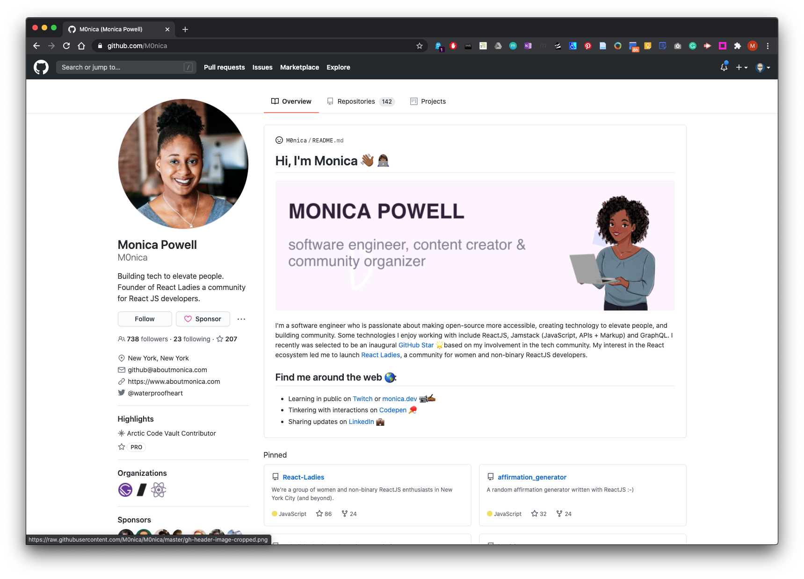
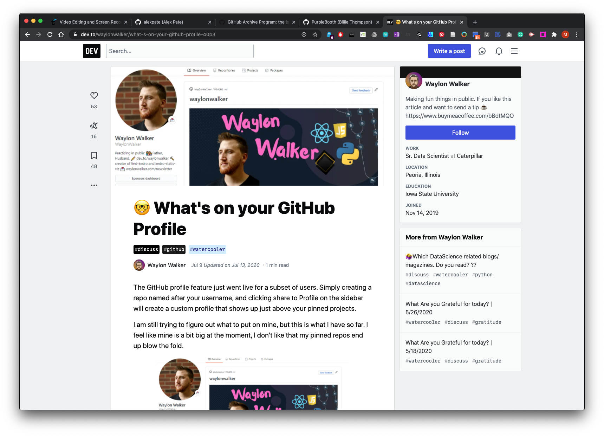
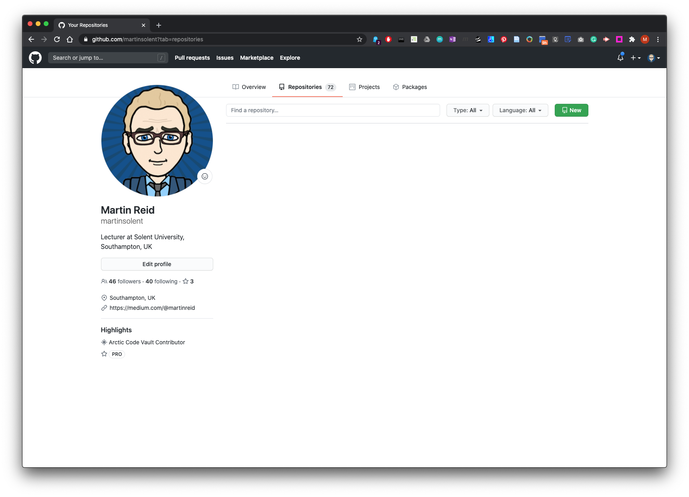
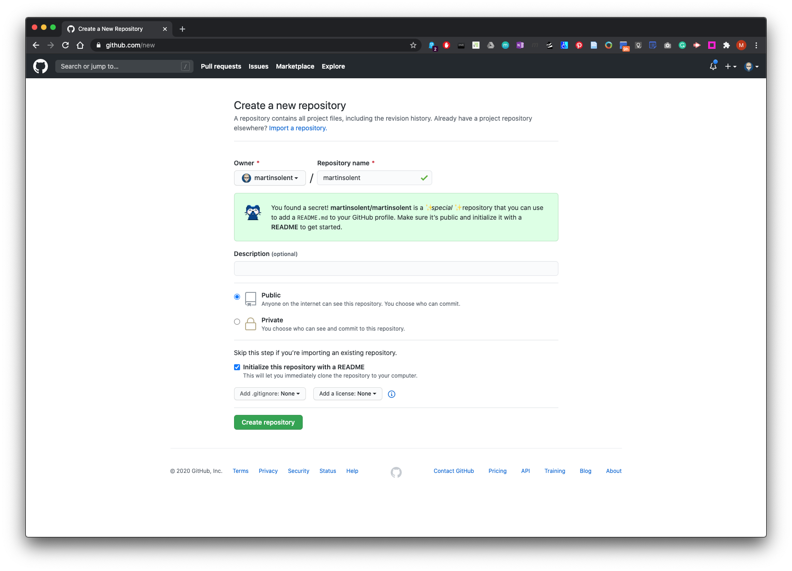
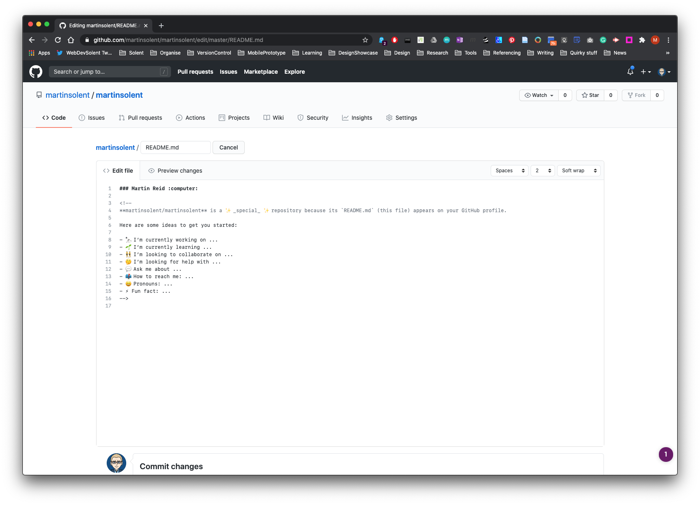
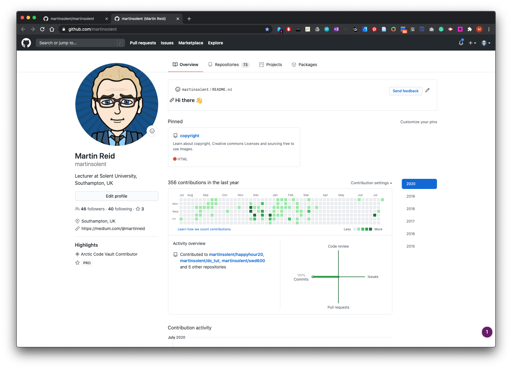
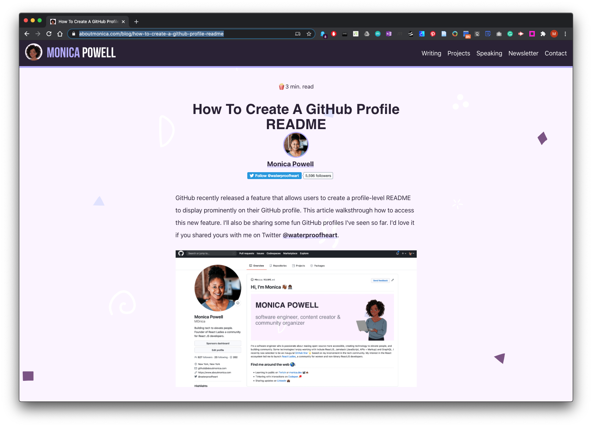
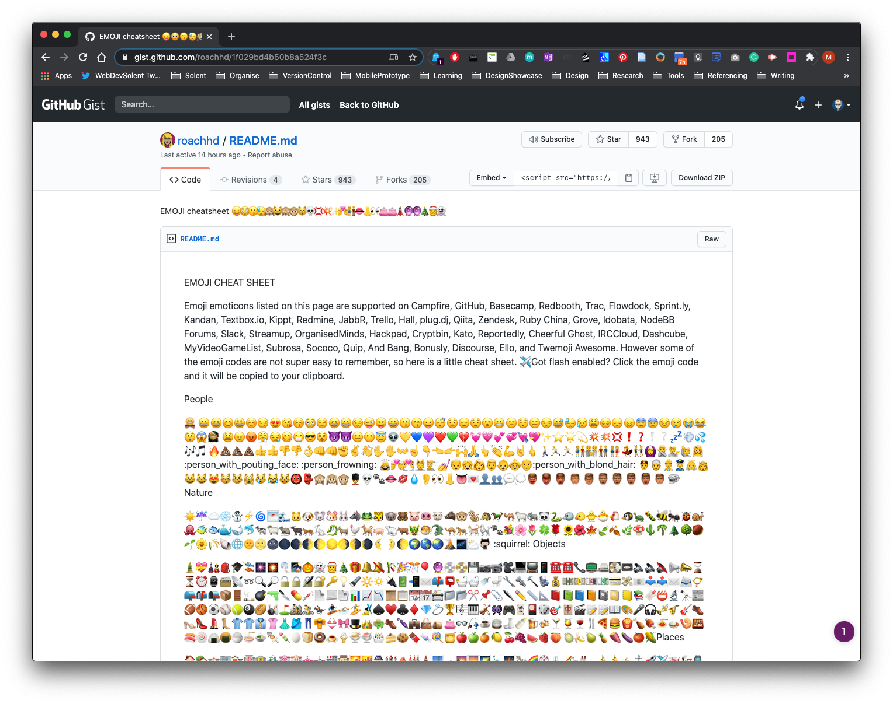

# GitHub Profile 2020
### How to create a main profile using new feature 2020

There are some new features on GitHub for creating a main promotional profile and pinning repositories on your Overview page like the example below:

POWELL.,M. 2020. *M0nica - Overview* [viewed 19 July 2020]. Available from: [https://github.com/M0nica](https://github.com/M0nica)

See more examples here: WALKER.,W. 2020. *What’s on your GitHub Profile* [viewed 19 July 2020]. Available from: https://dev.to/waylonwalker/what-s-on-your-github-profile-40p3

### How to create a main profile README in GitHub

Create a new repository:

Name this repo the same name as you GitHub Profile (remember this is case sensitive) Make sure you check the **Initialise this repository with a README**. Then click create repository.

Edit and update as you see fit such as add a promo banner,  GitHub offers you some pre-populated details which are commented out to get you started.

Name and commit changes

Now go to your main profile page - Overview and your README will be visable as a card pinned at the top of the page.

### Here is a tutorial here:

POWELL.,M., 2020. *How To Create A GitHub Profile README* [viewed 19 July 2020]. Available from: https://www.aboutmonica.com/blog/how-to-create-a-github-profile-readme

### How to insert Emojis in GitHub

BALL.,K. 2020. *EMOJI cheatsheet 😛😳😗😓🙉😸🙈🙊😽💀💢💥✨💏👫👄👃👀👛👛🗼🔮🔮🎄🎅👻* [viewed 19 July 2020]. Available from: https://gist.github.com/roachhd/1f029bd4b50b8a524f3c

